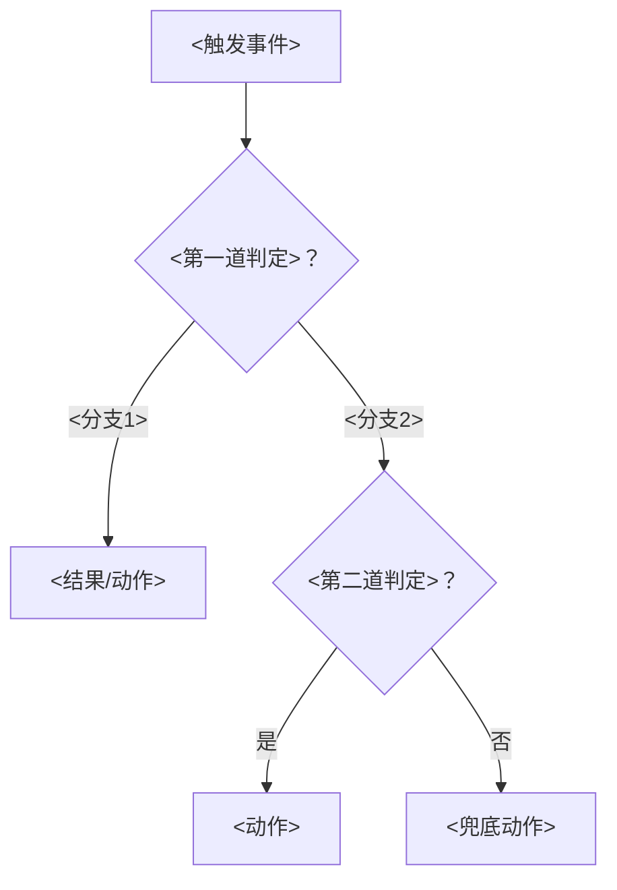

# 章节文件模板

每篇正文章节 = 一个"局限 → 机制 → 代价"循环。骨架如下（尖括号为占位符）：

```markdown
# <NN> <章节标题：机制名 + 它解决的那句话问题>

> 本篇对应问题：
> - "<学习者的原话问题 1>"
> - "<学习者的原话问题 2>"
> （还原真实提问；一个都没有时写本节对应的因果链环节）

## 1. 因果链定位（承接上一章）
上一章留下什么"不行"，本章的机制为何登场。一段话 + 必要时引用上一章编号。

## 2..N 正文（按理解顺序而非问答顺序组织）
- 机制是什么、怎么工作（术语首现必给大白话解释）
- 对话中效果最好的例子/类比优先复用
- 误解纠正：在发生的对应位置插入
  **❌ 直觉版**：<学习者的原话或典型错误理解>
  **✅ 修正版**：<精确表述>
  然后接推演过程，让读者知道"为什么直觉版诱人但错"
- 关键机制配一张 Mermaid 流程图（模板见下），复杂时序可用 sequenceDiagram
- 表格用于一切"多方案对比"（如 RDB vs AOF、部分同步 vs 全量）

## N+1. 边界与代价
该机制自带的坑 / 无法解决什么 / 引出下一篇的局限（衔接因果链）。

## N+2. 一句话总结
> <把全篇压缩成一句长句，加引用块>

## N+3. 自测题
1~5 题，全部考推演（"为什么 X 不解决 Y""用 A 的例子解释 B"）。

## 参考答案
逐题写完整推理链（不是名词解释）。答案之间尽量互相引用推演步骤，
让"重走一遍答案"等于"重学一遍本章"。
```

## 本篇未涉及的遗留问题（可选小节）

对话中冒出来但没展开的问题（如"集群客户端内部实现""持久化性能调优"），
列在此处成为下一篇的钩子，或标注"超出本次学习范围"。

## Mermaid 流程图骨架（决策类）



语法注意：
- 节点标签含 `()`、`%`、`:` 等字符时必须用引号包裹：`A["CRC16(key) % 16384 = 9000"]`
- 换行用 `<br/>`；边标签用 `-- "文本" -->` 或直接 `-- 文本 -->`
- 时序交互用 `sequenceDiagram`，`participant` 取短名

## 风格示例（节选自真实产出）

> **❌ 你的版本**：父进程有货，子进程只有地址，没货怎么抄？
> **✅ 正确**：货（物理页）本就摆在内存条上，不属于父也不属于子。子进程继承的页表每行都指向真实物理页——顺地址读出的就是真实字节。

> **一句话总结**：偏移量回答"差多少条命令"；复制 ID 回答"是不是同一条流的后代"；
> replid2 让 failover 后的新主认领旧流（只认领到提升点为止）；offset 越过认领截止线 = 数据分叉 = 全量重传。
