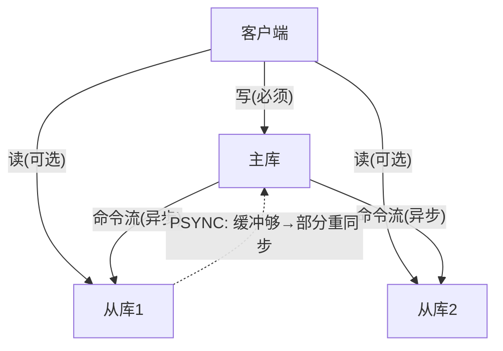

# 01 主从复制：读写分离的第一步

> 本篇对应问题：
> - "Redis 单机怎么处理大量读请求？"
> - "怎么让数据不丢？"

## 1. 因果链定位

单机 Redis 是单线程单进程，读多写少的负载很快把 CPU 打满；而且实例一挂数据就"没人接"。第一步解法：**同一份数据多个副本，写只走主、读可以摊到从**。

## 2. 机制：一主多从，异步传播

- 从库启动后发 `replconf` 握手，主库回填快照（RDB）+ 增量命令流
- 之后主库把每条写命令异步发给所有从库；断线重连时若复制积压缓冲还够，走 **部分重同步**（PSYNC + replid + offset），否则全量
- **大白话**：主库是广播塔，从库是收音机；缓冲够就"补播落下的节目"，不够就"从头重播"

> **❌ 直觉版**：主从复制就是把数据复制到从库，读写都可以随便走。
> **✅ 修正版**：复制是**异步**的，从库可能落后；写必须走主库，否则两边各写各的、数据直接分叉。

## 3. 一张图看懂

## 4. 边界与代价

- 异步复制：主库确认写入后立刻宕机，从库可能永远缺那最后几条——"不丢数据"在这里是**没有保证的**
- 从库只读且可能读到旧值；读写分离的业务要能接受最终一致
- 机制解决了"读扩展 + 热备"，没解决"主库挂了谁来把某个从库提成主"——**没有裁判**。这笔账留给哨兵，见 02 §自动故障转移

## 5. 一句话总结

> 主从复制用"写一条路、读多条路"换来读扩展与热备，但异步性欠下一致性延迟、单点故障时没有裁判这两笔账，直接引出哨兵。

## 6. 自测题

1. 为什么主库确认成功的写，从库上却可能查不到？用"广播塔"类比推一遍。
2. 断线 3 秒重连的从库，什么时候能走部分重同步、什么时候必须全量？关键判据是什么？
3. 有人说"多挂几个从库就不丢数据了"，这个说法糊在哪一步？

## 参考答案

1. 确认只说明主库本地追加成功；命令在网络上还没播完（或从库还没应用）时主库宕机，从库就缺这段。类比：电台宣布"节目已播出"，收音机可能正巧在换台。所以"不丢"要靠 WAIT/半同步类机制额外付代价，复制本身不给保证。
2. 判据是**主库的复制积压缓冲**是否还完整保留着从库 offset 之后的命令：在就部分重同步（补发差值），被覆盖就退回全量（重播）。所以缓冲大小 = 允许的断线时长 × 写速率，是内存换恢复速度的取舍。
3. 糊在"多个副本 ≠ 写入被多数确认"。异步下每个从库各自落后各的，宕机时刻没有任何一份副本保证含最新写。要接近"不丢"，必须让写入被多数节点确认后才返回成功——那是另一套代价（延迟上升、少数派宕机时卡写）。

---

下一篇：[02-哨兵机制.md](./02-哨兵机制.md) ｜ 返回：[README](./README.md)
