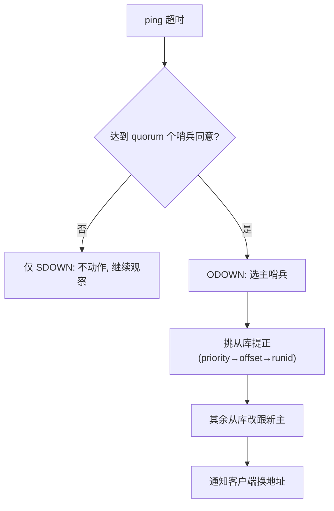

# 02 哨兵：给主从复制配一个裁判

> 本篇对应问题：
> - "主库挂了，谁来把从库提成主？人吗？"
> - "两个哨兵意见不一致怎么办？会不会切出两个主？"

## 1. 因果链定位

见 01 §边界与代价：复制有了热备，但**没有裁判**。哨兵就是那个不碰数据、只做判断与调度的第三方：监控所有节点，认定主库死亡后**替客户端完成换主**。

## 2. 机制：两级下线 + 仲裁

- 每个哨兵按 ping 超时各自判定 **SDOWN**（主观下线："我觉得它死了"）
- 哨兵之间交换看法，达到配置的 **quorum** 个哨兵同意才升格 **ODOWN**（客观下线："公认它死了"）
- **大白话**：SDOWN 是一个人的报警，ODOWN 是凑够法定人数立案。单个哨兵误判（自己网络抖动）不会触发切换

## 3. 自动故障转移

ODOWN 确立后：哨兵内部投票选出一个 leader 哨兵执行切换 → 从剩余从库里挑一个（优先级：replica-priority → 复制 offset 最新 → runid 最小）`REPLICAOF NO ONE` 提正 → 让其他从库改跟新主 → 用新主地址通知所有客户端。

## 4. 仲裁与防脑裂

- 切换需要多数派，网络分区时**少数派一侧凑不齐 quorum，就不敢切**——用"少数派不可用"换"不切出双主"
- 残余风险：旧主在分区里仍接受写，分区恢复后旧主被降级、期间的写被冲掉。可用 `min-replicas-to-write 1` + `min-replicas-max-lag 10` 让"没人在听"的主库**拒绝写入**，把丢失窗口压小
- **误解纠正**：
  > **❌ 直觉版**：哨兵数量配 2 个就够，互相有个对照。
  > **✅ 修正版**：偶数个哨兵在分区时两侧都可能凑不齐/都凑得齐多数，且 leader 选举要求哨兵**多数派存活**才能推进。要容忍 1 个哨兵挂就至少 3 个（quorum=2），要容忍旧主分区不双写还得靠 4 §代价里的写侧约束。

## 5. 边界与代价

- 所有节点仍持有**全量数据**：解决的是可用性，不是容量——写压力和内存上限还是单机天花板
- 哨兵自己也可能是被攻击/误判对象，生产至少 3 个、跨机架部署
- 容量这道墙，见 03 §哈希槽与路由

## 6. 一句话总结

> 哨兵用"两级下线 + quorum 立案 + 多数派选主"把换主从人肉操作变成协议动作，代价是少数派分区宁可不可用也不切换，且依然不解决容量单点。

## 7. 自测题

1. 只有 1 个哨兵时为什么 quorum 配成 1 反而危险？推演一次网络抖动。
2. 为什么挑新主要先看复制 offset 而不是先看机器好坏？
3. `min-replicas-to-write` 牺牲了什么换来什么？在什么业务里这笔交易划算？

## 参考答案

1. quorum=1 意味着单哨兵的 SDOWN 直接等于 ODOWN——它自己 ping 不通（它网卡抖一下）就会"公认主库死亡"并触发切换，把一个活主库强制降级。裁判先得足够多且互相独立，误判才能被多数派稀释。
2. 提正的目的是让新主**离死亡主库的数据最近**，offset 大的从库缺的命令最少，切换后丢的数据窗口最小。机器好坏影响的是性能，不是正确性；数据完整度优先。
3. 牺牲可用性（低于 1 个合格从库时主库拒绝写），换一致性上界（没有旁观者的写入大概率随旧主陪葬，宁可不让发生）。对"账不能错"的场景（扣库存、金融流水）划算；对"宁可多算一单也不能停写"的场景则相反，这正是取舍要显式写出来的原因。

---

上一篇：[01-主从复制.md](./01-主从复制.md) ｜ 下一篇：[03-Cluster分片.md](./03-Cluster分片.md) ｜ 返回：[README](./README.md)
