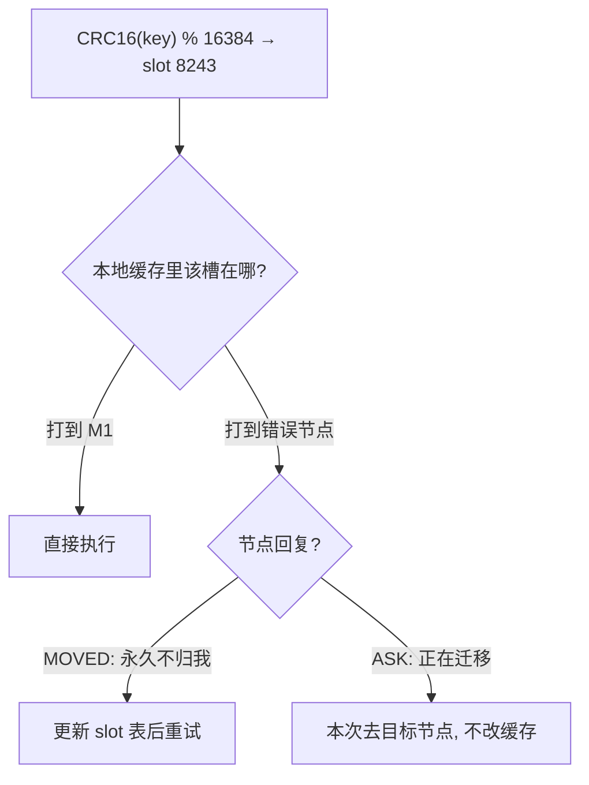

# 03 Cluster：分片扩出去，原子性付出去

> 本篇对应问题：
> - "内存和写吞吐到顶了，哨兵也救不了，怎么办？"
> - "客户端怎么知道该连哪台？"

## 1. 因果链定位

见 02 §边界与代价：哨兵保住可用性但每个节点仍存全量数据，容量与写吞吐是单机天花板。出路：**把数据切开**——每个主节点只负责一部分 key，这就是 Cluster。

## 2. 哈希槽与路由

- key 不再直接映射节点，而是先映射到 **16384 个槽**：`CRC16(key) % 16384`；槽再按配置分给各主节点
- **为什么中间隔一层槽而不直接按节点数取模**：扩容/缩容时只需要迁移"槽→节点"的映射，key 的槽归属不变；直接对节点数取模会让几乎所有 key 重新洗牌
- 客户端本地缓存 slot→node 表：命中直连；错了节点回 **MOVED**（永久错，更新缓存）或 **ASK**（槽正在迁移，这次去目标节点问）

## 3. 故障转移：分片自带哨兵

Cluster 里不再外挂哨兵：主节点之间用 **Gossip** 交换槽表与状态，判定下线的方式和 02 神似（自己看到的 PFAIL 需要其他主用 FAIL 消息确认），随后**存活的多数主节点**投票、由票数胜出的从库接管。换句话说：哨兵协议被内建进了集群本身。

## 4. 边界与代价

- **跨槽操作基本失效**：多 key 命令/事务要求同槽，只能靠 hash tag `{user}` 人为绑定——但热 key 也随之扎堆
- 迁移槽期间该槽请求会慢（ASK 一跳），大 key 迁移会阻塞目标节点
- 集群最小可用单元是"每分片至少一个主"：某分片主从全灭则**整集群可选地拒绝服务**（`cluster-require-full-coverage`），扩展性换来了运维复杂度的大头
- **误解纠正**：
  > **❌ 直觉版**：Cluster 分片了，所以一个分片挂了其他分片照常全功能。
  > **✅ 修正版**：挂掉分片上的槽没人认领，默认策略下整个集群拒绝读写（宁缺毋滥保覆盖语义）；改配置放行则只影响那 1/N 的 key——"局部坏"会以哪种方式伤全局，是配置出来的取舍，不是免费的高可用。

## 5. 一句话总结

> Cluster 用"key→槽→节点"的两级映射把容量与写吞吐横向铺开、把故障转移内建进 Gossip 投票，代价是跨槽原子性被砍、迁移期变慢、单分片全灭时全局要么停写要么部分不可用。

## 6. 自测题

1. 扩容加 1 个节点时，为什么"直接按节点数取模"的方案会把几乎所有 key 变成孤儿？对比槽方案各迁移多少。
2. MOVED 和 ASK 分别在什么时刻出现？为什么 ASK 不允许客户端改本地缓存？
3. 用 hash tag 把所有 key 绑到一个标签上，等于把哪件 01/02 时代的旧病请回来了？

## 参考答案

1. 取模结果 = f(节点数)：N→N+1 时 `hash % N` 与 `hash % (N+1)` 对几乎所有 key 给出不同节点，等于全量搬迁且过渡期两边都不认。槽方案把洗牌粒度固定为 16384 个槽：加节点只需从现有节点**匀出**若干连续槽段，其余 key 原地不动。
2. MOVED 在"槽永久归属已变、客户端缓存过期"时出现，客户端应更新 slot 表；ASK 出现在**槽迁移进行中**——目标节点可能还没接完，数据所有权未最终落定，若客户端此刻改缓存，就会把"临时中转"当成永久路由，下次直接跳过原主造成读不到。所以 ASK 只许本次转发、不许改表。
3. 绑同一标签 → 全部 key 落同一槽 → 同一节点：读写又回到单机串行、内存天花板回到一台机器——相当于花钱部署了集群，却退回 01 之前的单实例，还额外背上了集群的运维复杂度。

---

上一篇：[02-哨兵机制.md](./02-哨兵机制.md) ｜ 返回：[README](./README.md)
