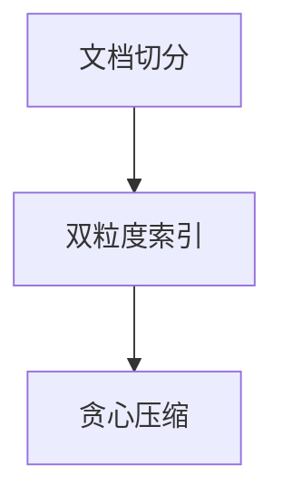

<!-- fixture: 故意违规，勿修 —— 埋错：思维导图里出现了 ``` 代码围栏（E-MM-FENCE） -->

# Zephyr：面向长文档问答的分层记忆压缩

## 研究背景与目标

- 上下文窗口预算有限
- 证据可能散落在文档任意位置

## 研究方法

- 双粒度索引：粗筛加精排
- 按边际增益贪心选块

## 关键研究结果

- 端到端延迟降至基线的 0.60×
- 召回率相对全文拼接仅下降 1.2 个百分点

## 研究结论与意义

- 免训练的分层压缩可行
- 可直接套用到现成检索管线

以下流程图本应直接输出 Markdown，这里却用了围栏占位：


