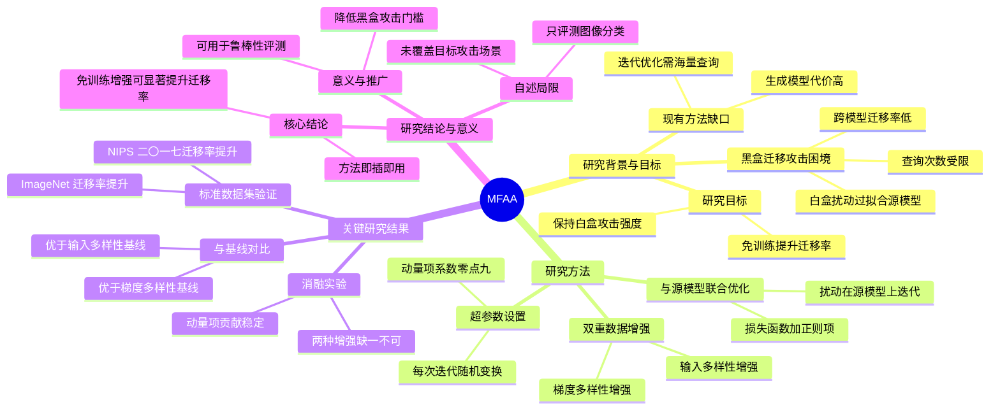

# MFAA：面向迁移攻击的双重数据增强

```mermaid
mindmap
  root((MFAA))
    研究背景与目标
      黑盒迁移攻击困境
        白盒扰动过拟合源模型
        跨模型迁移率低
        查询次数受限
      现有方法缺口
        迭代优化需海量查询
        生成模型代价高
      研究目标
        免训练提升迁移率
        保持白盒攻击强度
    研究方法
      双重数据增强
        输入多样性增强
        梯度多样性增强
      与源模型联合优化
        扰动在源模型上迭代
        损失函数加正则项
      超参数设置
        动量项系数零点九
        每次迭代随机变换
    关键研究结果
      标准数据集验证
        NIPS 二〇一七迁移率提升
        ImageNet 迁移率提升
      与基线对比
        优于输入多样性基线
        优于梯度多样性基线
      消融实验
        两种增强缺一不可
        动量项贡献稳定
    研究结论与意义
      核心结论
        免训练增强可显著提升迁移率
        方法即插即用
      意义与推广
        降低黑盒攻击门槛
        可用于鲁棒性评测
      自述局限
        只评测图像分类
        未覆盖目标攻击场景
```
