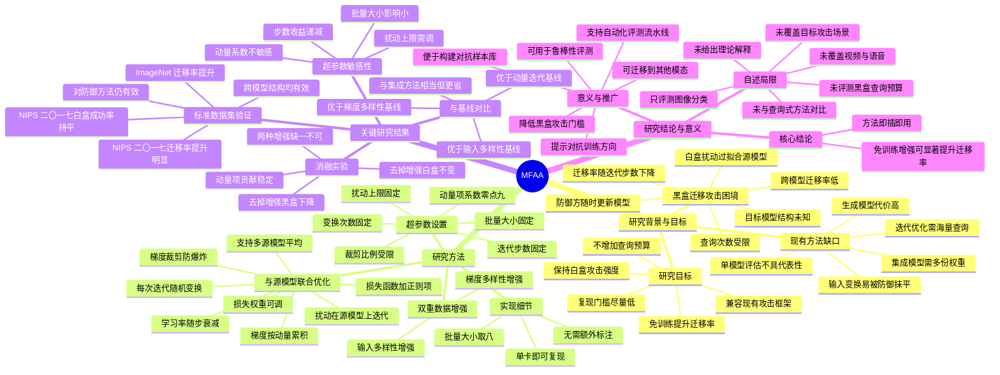

<!-- warn fixture: 只埋 W-MMD-BLOAT —— 节点总数 86，超过 80 上限（退出码应为 0） -->

# MFAA：面向迁移攻击的双重数据增强

```mermaid
mindmap
  root((MFAA))
    研究背景与目标
      黑盒迁移攻击困境
        白盒扰动过拟合源模型
        跨模型迁移率低
        查询次数受限
        目标模型结构未知
        防御方随时更新模型
        迁移率随迭代步数下降
      现有方法缺口
        迭代优化需海量查询
        生成模型代价高
        集成模型需多份权重
        输入变换易被防御抹平
        单模型评估不具代表性
      研究目标
        免训练提升迁移率
        保持白盒攻击强度
        不增加查询预算
        兼容现有攻击框架
        复现门槛尽量低
    研究方法
      双重数据增强
        输入多样性增强
        梯度多样性增强
      与源模型联合优化
        扰动在源模型上迭代
        损失函数加正则项
        每次迭代随机变换
        梯度按动量累积
        梯度裁剪防爆炸
        学习率随步衰减
        支持多源模型平均
        损失权重可调
      超参数设置
        动量项系数零点九
        迭代步数固定
        扰动上限固定
        裁剪比例受限
        批量大小固定
        变换次数固定
      实现细节
        批量大小取八
        单卡即可复现
        无需额外标注
    关键研究结果
      标准数据集验证
        NIPS 二〇一七迁移率提升明显
        NIPS 二〇一七白盒成功率持平
        ImageNet 迁移率提升
        跨模型结构均有效
        对防御方法仍有效
      与基线对比
        优于输入多样性基线
        优于梯度多样性基线
        优于动量迭代基线
        与集成方法相当但更省
      消融实验
        两种增强缺一不可
        动量项贡献稳定
        去掉增强白盒不变
        去掉增强黑盒下降
      超参数敏感性
        动量系数不敏感
        步数收益递减
        扰动上限需调
        批量大小影响小
    研究结论与意义
      核心结论
        免训练增强可显著提升迁移率
        方法即插即用
      意义与推广
        降低黑盒攻击门槛
        可用于鲁棒性评测
        可迁移到其他模态
        提示对抗训练方向
        支持自动化评测流水线
        便于构建对抗样本库
      自述局限
        只评测图像分类
        未覆盖目标攻击场景
        未评测黑盒查询预算
        未覆盖视频与语音
        未与查询式方法对比
        未给出理论解释
```
