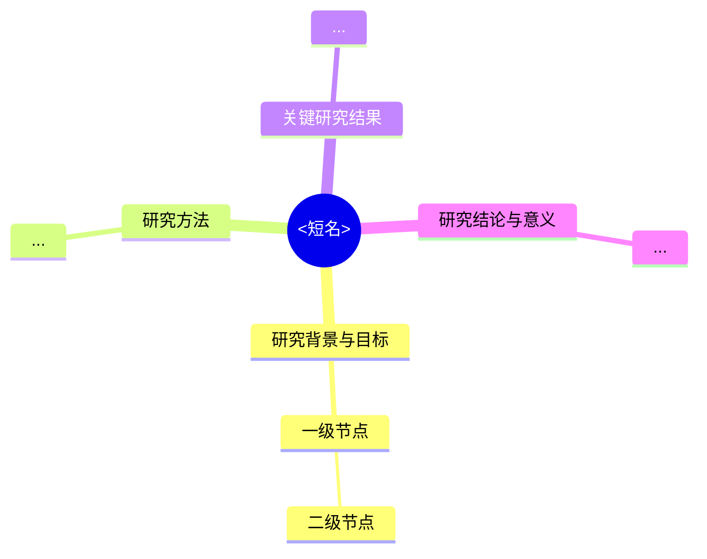

# 模式 C 模板：思维导图（`思维导图-<短名>.md`）

## 硬结构（机械校验会查）

- 首行是唯一的 `# <论文标题>`。
- 一级分支**恰好四个**，名称与顺序固定：
  `## 研究背景与目标`、`## 研究方法`、`## 关键研究结果`、`## 研究结论与意义`。
- 只用 `-` 无序列表；层级 ≤ 4 层（1 个 `-` 为第 1 层，每缩进 2 空格加一层）。
- 每个分支下至少 2 个节点。
- **不得出现 ```` ``` ```` 代码围栏**，直接输出 Markdown。
- 节点总数建议 ≤ 80：思维导图是索引，不是全文搬家。

## 交付纪律（必须与讲解文档分开）

- 思维导图**独立成文件**（`思维导图-<短名>.md`）、**独立呈现**：不要追加在 `深读-<短名>.md` 末尾，也不要在讲解正文之后紧接一份导图。
- 同一条回复若要交付多件，先给“文件清单 + 每件一句话”，再分块呈现；导图单独成块，块首写明文件名。
- 导图本身不写引言、不写解释、不写“以上是思维导图”之类收尾。

## 两种形态都要出：文本大纲 + 可渲染 Mermaid

同一个导图出**两个文件**，各有用途，不要用一个替代另一个：

| 文件 | 形态 | 用途 |
|------|------|------|
| `思维导图-<短名>.md` | 文本大纲（上面那套硬结构） | 跨任何 harness 可读、可 grep、可 diff，是主形态 |
| `导图-<短名>.md` | Mermaid mindmap | 在支持 Mermaid 的渲染器里出真正的图形 |

### 渲染能力对照（先对齐预期）

| 渲染器 | 能否渲染 Mermaid mindmap |
|--------|--------------------------|
| Obsidian（本工作区有 `.obsidian`） | 能，原生支持 ` ```mermaid ` |
| GitHub（README / Issue / PR） | 能 |
| VS Code | 需要 Markdown Preview Mermaid Support 一类扩展 |
| DSH Web GUI（当前界面） | **不能**——DSH 只带 shiki 的 `mermaid` 语法高亮，没有 mermaid 渲染器，只会按代码块显示 |

### `导图-<短名>.md` 的硬结构

````text
# <论文标题>


````

- 唯一 `#` 标题；**恰好一个** ` ```mermaid ` 围栏块，块内第一个非空行是 `mindmap`。
- **恰好一个根节点**，写法 `root((<短名>))`。
- 四个固定分支作为根的一级子节点，名称与顺序固定。
- 缩进即层级（每层 2 空格），**最多 4 层**。
- **节点文本里不要出现 ASCII 的 `( ) [ ] { } , ; : %`**：改用中文标点（，、：）或直接去掉标点——这些字符会让 Mermaid 解析失败（校验码 `E-MMD-SYNTAX`）。
- 节点总数 ≤ 80（`W-MMD-BLOAT`）；围栏外除标题外不写任何正文（`W-MMD-TEXT`）。

## 节点写法

- 每个节点是一个**概念短语**，不写整句；需要量化就带数字（`Top-5 错误率降至 3.57%`）。
- 机制类节点写"做什么"，不写"很重要"这类评价。
- 关键模块要在叶子上给约束/代价（`- 需要额外超参 λ`）。
- 中文为主；论文术语保留英文原词一次，如 `残差学习 (Residual Learning)`。

## One-Shot 范例（仅示范形状，不要照抄内容）

```text
# Deep Residual Learning for Image Recognition

## 研究背景与目标
- 退化问题 (Degradation Problem)
  - 网络加深后准确率饱和甚至下降
  - 并非过拟合导致
- 核心目标
  - 训练 100 层以上的可收敛网络

## 研究方法
- 残差学习框架
  - 拟合残差函数 F(x) = H(x) - x
  - 恒等映射作为捷径连接
- 网络架构
  - 3x3 卷积堆叠
  - 全局平均池化替代全连接

## 关键研究结果
- ImageNet 竞赛夺冠
  - Top-5 错误率 3.57%
- 深度收益验证
  - 152 层优于 VGG-16

## 研究结论与意义
- 核心贡献
  - 证明残差结构可训练极深网络
- 影响
  - 成为视觉骨干网络标准
- 局限
  - 极深网络训练成本高
```

（范例本身省去了代码围栏标记：真实产物直接输出上述内容。）
