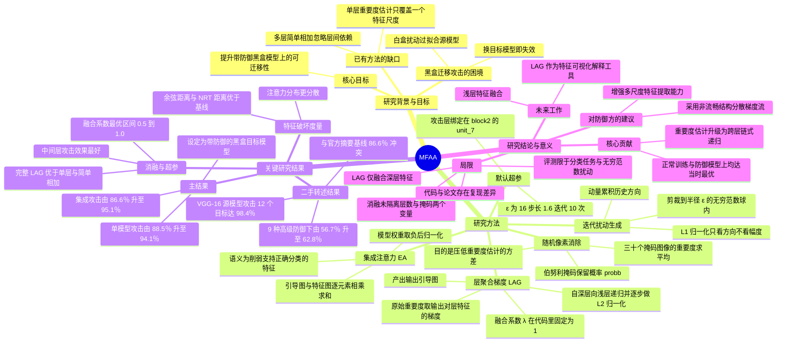

# Enhancing the Transferability of Adversarial Attacks via Multi-Feature Attention

```mermaid
mindmap
  root((MFAA))
    研究背景与目标
      黑盒迁移攻击的困境
        白盒扰动过拟合源模型
        换目标模型即失效
      已有方法的缺口
        单层重要度估计只覆盖一个特征尺度
        多层简单相加忽略层间依赖
      核心目标
        提升带防御黑盒模型上的可迁移性
    研究方法
      层聚合梯度 LAG
        原始重要度取输出对层特征的梯度
        自深层向浅层递归并逐步做 L2 归一化
        融合系数 λ 在代码里固定为 1
        产出输出引导图
      集成注意力 EA
        引导图与特征图逐元素相乘求和
        模型权重取负后归一化
        语义为削弱支持正确分类的特征
      随机像素消除
        伯努利掩码保留概率 probb
        三十个掩码图像的重要度求平均
        目的是压低重要度估计的方差
      迭代扰动生成
        动量累积历史方向
        L1 归一化只看方向不看幅度
        剪裁到半径 ε 的无穷范数球内
      默认超参
        ε 为 16 步长 1.6 迭代 10 次
        攻击层绑定在 block2 的 unit_7
    关键研究结果
      主结果
        单模型攻击由 88.5％ 升至 94.1％
        集成攻击由 86.6％ 升至 95.1％
        设定为带防御的黑盒目标模型
      二手转述结果
        VGG-16 源模型攻击 12 个目标达 98.4％
        9 种高级防御下由 56.7％ 升至 62.8％
        与官方摘要基线 86.6％ 冲突
      消融与超参
        完整 LAG 优于单层与简单相加
        融合系数最优区间 0.5 到 1.0
        中间层攻击效果最好
      特征破坏度量
        余弦距离与 NRT 距离优于基线
        注意力分布更分散
    研究结论与意义
      核心贡献
        重要度估计升级为跨层链式递归
        正常训练与防御模型上均达当时最优
      对防御方的建议
        增强多尺度特征提取能力
        采用非流畅结构分散梯度流
      局限
        LAG 仅融合深层特征
        消融未隔离层数与掩码两个变量
        评测限于分类任务与无穷范数扰动
        代码与论文存在复现差异
      未来工作
        浅层特征融合
        LAG 作为特征可视化解释工具
```
